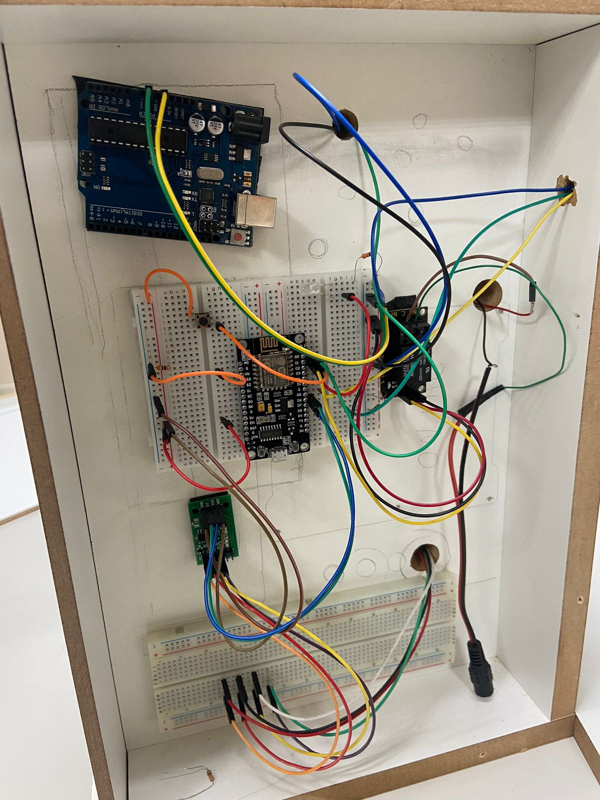
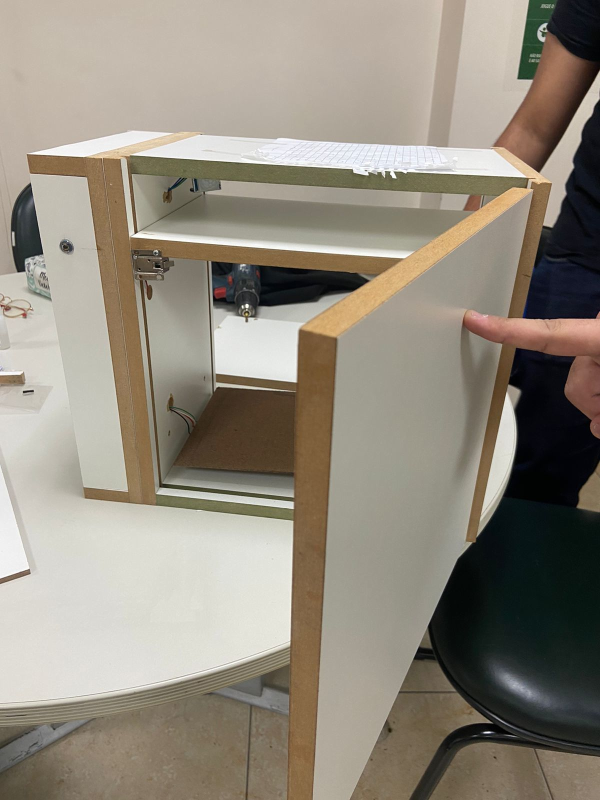
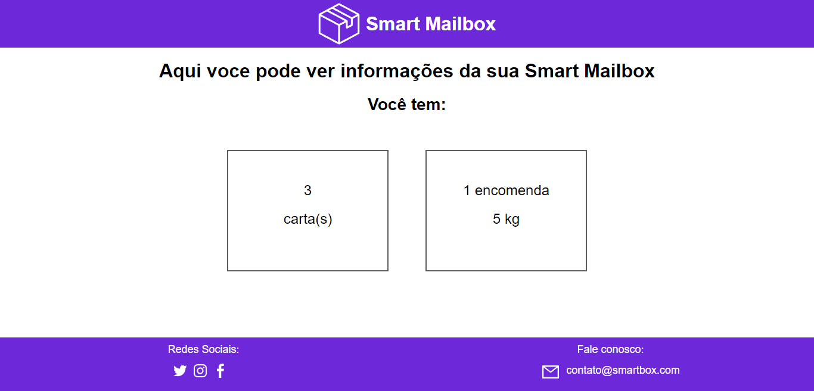

# Projeto 04 - CaixaDeCorreiosInteligente

## Smart Mailbox é uma caixa de correios inteligente feita para receber entregas com segurança sem a necessidade de estar alguém em casa.

## 📷 Imagens do projeto

## 💻 Layout do site

 

## 👷 Projeto em uso

 

## Motivação

Essa aplicação foi feita para entrega do projeto indisciplinar para a instituição de ensino [FECAP](https://www.fecap.br/)

## Integrantes

- [Débora Souza Matos - RA: 22023906](https://github.com/sm1dbr) 
- [João Fernando de Lima Gonçalves - RA: 22023774](https://github.com/Joao-F3rnando) 
- [Lucas Holanda Cardoso - RA: 19020682]() 
- [Mateus Quintino V. dos Santos - RA: 22023854](https://github.com/Mateus-Kent) 
- [Raquel Anicio dos Santos - RA: 21022954](https://github.com/rqands) 

## Licença

Este projeto está licenciado sob a [Licença MIT](LICENSE)

## :test_tube: Tecnologias

### C

C é uma linguagem de programação compilada de propósito geral, estruturada, imperativa, procedural, padronizada pela Organização Internacional para Padronização, criada em 1972 por Dennis Ritchie na empresa AT&T Bell Labs para desenvolvimento do sistema operacional Unix.

Website: https://docs.microsoft.com/pt-br/cpp/c-language/?view=msvc-170

### C++

C++ é uma linguagem de programação compilada multi-paradigma e de uso geral. Desde os anos 1990 é uma das linguagens comerciais mais populares, sendo bastante usada também na academia por seu grande desempenho e base de utilizadores.

Website: https://docs.microsoft.com/pt-br/cpp/?view=msvc-170

### Arduino IDE

Arduino Integrated Development Environment é uma aplicatição de plataforma cruzada, escrito em funções de C e C ++. É usado para escrever e fazer upload de programas em placas compatíveis com Arduino, mas também, com a ajuda de núcleos de terceiros, outras placas de desenvolvimento de fornecedores.

Website: https://www.arduino.cc/

### HTML

HTML é uma linguagem de marcação utilizada na construção de páginas na Web. Documentos HTML podem ser interpretados por navegadores. A tecnologia é fruto da junção entre os padrões HyTime e SGML. HyTime é um padrão para a representação estruturada de hipermídia e conteúdo baseado em tempo.

Website: https://developer.mozilla.org/pt-BR/docs/Web/HTML

### CSS 
CSS (Cascading Style Sheets ou Folhas de Estilo em Cascata) é uma linguagem de estilo (en-US) usada para descrever a apresentação de um documento escrito em HTML ou em XML (incluindo várias linguagens em XML como SVG, MathML ou XHTML). O CSS descreve como elementos são mostrados na tela, no papel, na fala ou em outras mídias.

Website: https://developer.mozilla.org/pt-BR/docs/Web/CSS

### ESP8266WebServer

A classe WebServer é um servidor web simples que sabe como lidar com solicitações HTTP como GET e POST e pode suportar apenas um cliente simultâneo.

Website: https://github.com/esp8266/Arduino/tree/master/libraries/ESP8266WebServer

### ESP8266WiFi

O ESP8266WiFi é uma biblioteca feita somente para conectar seu ESP8266 em um rede WiFi

Website: https://arduino-esp8266.readthedocs.io/en/latest/esp8266wifi/readme.html

### HX711

Uma biblioteca Arduino para interfacear o Avia Semiconductor HX711 24-Bit Analog-to-Digital Converter (ADC) para leitura de células de carga/balanças de peso.

Website: https://github.com/bogde/HX711

## Instalação

### GIT

- Instale o git em sua máquina: https://git-scm.com/downloads
- Com o git instalado em sua máquina, clone o repositório usando o botão **Code** em https://github.com/2022S1P1/Projeto04-CaixaDeCorreiosInteligente.git

### Agora apenas rode seu programa com a [Arduino IDE](https://www.arduino.cc/en/software)
